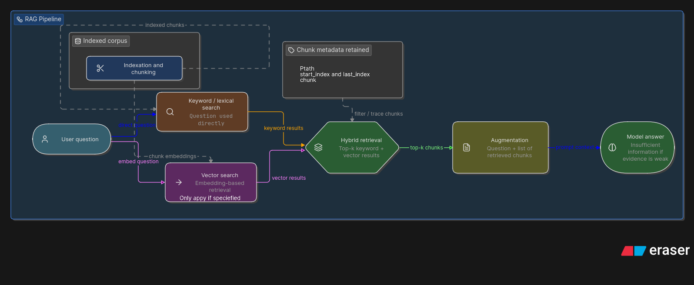
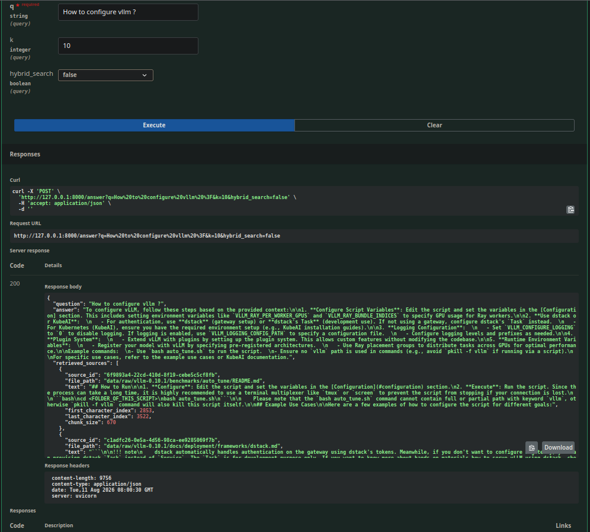

_This project has been created as part of the 42 curriculum by finorako._

# RAG

<!--toc:start-->

- [RAG](#rag)
  - [Description](#description)
  - [Instructions](#instructions)
    - [**Cli**: Using the terminal](#cli-using-the-terminal)
    - [**Api**: For this, you can access only two APIs for now](#api-for-this-you-can-access-only-two-apis-for-now)
  - [Resource](#resource)
  - [AI usage](#ai-usage)
  - [CHALLENGE ENCOUNTERED](#challenge-encountered)
  - [System architecture](#system-architecture)
  - [Chunking strategy](#chunking-strategy)
  - [Performance analysis](#performance-analysis)
    - [Recall@k](#recallk)
  - [Design decisions](#design-decisions)
    - [Quality](#quality)
    - [Process](#process)
  - [TODO](#todo)
  - [Example usage](#example-usage)
    - [CLI](#cli)
    - [API](#api)
  <!--toc:end-->

## Description

As we know, LLM sometimes hallucinate and gives us answer that will convince us
if the answer is not in it's database if it's not trained on it yet.
To resolve this issue, we introduce RAG (Retrieval-Augmented Generation) where we
give the LLM our own datasets it has to choose the answer from because
retraining it will cost more time and resources than it need to.

## Instructions

To launch this project, you can choose between those
three method bellow:

But before everything, you should run the command bellow.

```bash

export UV_CACHE_DIR="$HOME/goinfre/.cache/uv"
export UV_LINK_MODE=copy

export HF_HOME="$HOME/goinfre/.cache/huggingface"
export HUGGINGFACE_HUB_CACHE="$HF_HOME/hub"
export TRANSFORMERS_CACHE="$HF_HOME/transformers"

export OLLAMA_MODELS=$(HOME)/goinfre/.models

# and then make run
```

### **Cli**: Using the terminal

- `uv run python -m index --max_chunk_size # indexing the corpus`
- `uv run python -m search 'query' --k 10 --hybrid #
retrieve from dataset to answer query`
- `uv run python -m answer 'query' --k 10 --hybrid #
answer query`
- `uv run python -m search_dataset --dataset_path <> --k 10 --save_directory <>
--hybrid # from a dataet we retrieve from the corpuse`
- `uv run python -m answer_dataset --student_search_results_path <> --k <>
--save_directory <> # given a dataset we answer all the question from it.`

### **Api**: For this, you can access only two APIs for now

- `curl -X POST "<http://127.0.0.1:8000/answer>" -G --data-urlencode -
"{q='What is VLLM ?'}"` but you must first run the command `uvicorn src.api:app`
- Or accessing it via the _Swagger UI_ provided by FastApi.

## Resource

- [What is chunking](https://medium.com/the-ai-forum/semantic-chunking-for-rag-f4733025d5f5)
- [Understanding what is overlapping chunk and chunk size](https://medium.com/@jagadeesan.ganesh/understanding-chunking-algorithms-and-overlapping-techniques-in-natural-language-processing-df7b2c7183b2)
- [Understanding chunking](https://medium.com/@yasir_siddique/understanding-recursive-character-text-splitting-8419518db6f4)
- [Code a simple RAG Hugging Face](https://huggingface.co/blog/ngxson/make-your-own-rag)
- [How does BM25 work](https://www.geeksforgeeks.org/nlp/what-is-bm25-best-matching-25-algorithm/)
- [Understanding and implementing text ranking algorithm](https://medium.com/@macikgozm/tf-idf-vs-bm25-understanding-and-implementing-text-ranking-algorithms-in-python-f56111f5086b)
- [Lemmatization vs Stemming](https://www.geeksforgeeks.org/nlp/lemmatization-vs-stemming/)
- [Processing text](https://medium.com/@myselfnilu29/preprocessing-text-23ea7b94c3be)
- [Data chunking and indexing: the difference](https://yodaplus.com/blog/data-chunking-vs-indexing-whats-the-difference/)
- [Lemmatization doc](https://www.nltk.org/api/nltk.stem.wordnet.html#nltk.stem.wordnet.WordNetLemmatizer)
- [Removing stop word with nltk](https://www.geeksforgeeks.org/nlp/removing-stop-words-nltk-python/)
- [Lemmatization with NLTK](https://medium.com/techmind-chronicles/nlp-series-part-3-lemmatization-with-nltk-smarter-text-normalization-with-pos-tags-3f2d9ea212ea)
- [bm25](https://huggingface.co/blog/xhluca/bm25s)
- [Understanding recall@k](https://krishnapullak.medium.com/understanding-precision-recall-and-f-score-at-k-in-recommender-systems-7146a0dce68e)
- [Vllm inference engine interview](https://www.techinterview.net/questions/vllm-inference-engine-interview-questions)
- [Hybrid Search](https://medium.com/@mahima_agarwal/hybrid-search-bm25-vector-embeddings-the-best-of-both-worlds-in-information-retrieval-0d1075fc2828)
- [Hybrid search explained](https://redis.io/blog/hybrid-search-explained/)
- [HUggingFace All-Minilm-L6-v2](https://huggingface.co/sentence-transformers/all-MiniLM-L6-v2)
- [MMR](https://medium.com/data-science-collective/building-a-rag-system-with-mmr-for-safaricoms-smart-assistant-1e9ba91b9bfe)
- [Cold start](https://medium.com/codex/development-cold-start-dad87e7836d1)
- [Python RAG API](https://www.vitaliihonchar.com/insights/python-rag-api)
- [Building a rag API](https://medium.com/@elijahchimera01/building-a-rag-api-with-fast-api-07b8ee6db413)
- [Incremental indexing strategies](https://medium.com/@vasanthancomrads/incremental-indexing-strategies-for-large-rag-systems-e3e5a9e2ced7)
- [Faiss Vector database](https://learnmycourse.medium.com/faiss-vector-databases-and-embeddings-444f589dd0f9)
- [RAG crash course](https://www.youtube.com/watch?v=swvzKSOEluc)
- [Recall@k](https://123ofai.com/articles/blocks/recall-at-k)
- [IoU](https://medium.com/@imadityarathore/understanding-iou-the-key-metric-for-object-detection-accuracy-109be9461a09)
- [Recall@k and IoU metrics](https://medium.com/@ayushigupta9723/rags-evaluation-metrics-and-standard-industrial-pipeline-to-do-evaluation-f37c3791a2f8)
- [More detail about IoU](https://pmc.ncbi.nlm.nih.gov/articles/PMC12945362/)
- [Eraser](app.eraser.io)

## AI usage

NO AI WAS USED DURING THE DEVELOPMENT OF THIS PROJECT.
Other than the [Diagram in Systsystem-architecture](#system-architecture)

## CHALLENGE ENCOUNTERED

- During development I encountered an issue, which was I planed to go
  in the path of lemmatization, but after going that path a lot further,
  I learned that it is not best for code in a RAG, but I don't think it was a
  wast time learning about it as I learned a new thing with it.
- I think the most reason my solution's recall is so low is because of the way
  i get the _last_character_index_ and _first_character_index_ but for now, I don't
  see a solution for this problem. But I might find the solution in the near future.
- During my first try of this project, my code was somewhat a mess, so I didn't know
  where the error or bugs where, but after redoing it I found out that the my retrieval
  was the issue.

## System architecture

For the implementation, I followed the diagram bellow
It is worth notice that the diagram bellow, doesn't provide
much information about the caching strategies. But for that
part, before doing any operation i verify if the provided
parameters was already seen (in the cache), if yes, i just
return the return value corresponding to that overesise I
do the operation and then store the returned value in the cache
for later retrieval.



## Chunking strategy

This part was the very bothersome part of this project, as I
was stuck between choosing the best chunk for code and readme.

For the two type of file, I used the same function from the
`RecursiveCharacterTextSplitter` class provided by the `langchain_text_splitters
from_language`. This tries to chunk the file in a manner that respect the chunk_size
, the separator, and the type of language the file use (Language.PYTHON and Language.MARKDOWN)

By default the `RecursiveCharacterTextSplitter` try to chunk documents based on
ast: Meaning for python file, it tries to chunk it from class first and then going
to space.

## Performance analysis

To see if my implementation is doing in the direction I wanted to
(achieve 50% on code and 80% on docs search on recall@5)

### Recall@k

Recall@k was very useful as a way to see what to improve.

### Evaluate function

There was also my evaluate function, it helped me for viewing my Performance as
well.

## Retrieval method

This part was the reason why my recall was very low. So after reviewing my
previous code, I did a simple RRF if the hybrid parameter is true. Overwise
I just get the top-k results returned by the bm25 retrieval.

The rrf is the same as doing a minimum on the rank of the source
from the vector search and bm search and sorting those values
in a way that let us take the best match.

## Design decisions

### Quality

My core idea behind the implementation is very clear, just finish the
project for know, and then implement the rest my own such as the BM25 or/and
the chunking part using C. In other words, my implementation's results isn't very
efficient, it just achieve the goal the subject asked for.

### Process

For the process part, as i coded the application, I saw that the line inside my
main application began to be very tight, and at that part did I began to split them
in them separate module or class. Which was a tedious task. I should have
split them from the beginning.

## TODO

- IMPLEMENTING BM25
- IMPLEMENTING CHUNKING
- IMPLEMENTING INCREMENTAL INDEXING.

## Example usage

### CLI

Running the command provided in the [Instructions](#instructions) you can
lunch this application.

### API

Launch `make` then `make lanch-api` you will see that
the Swager UI is ready by going to the site _<http://127.0.0.1:8000/docs>_
after that you can interact with the current exposed api such as:

- answer
  
